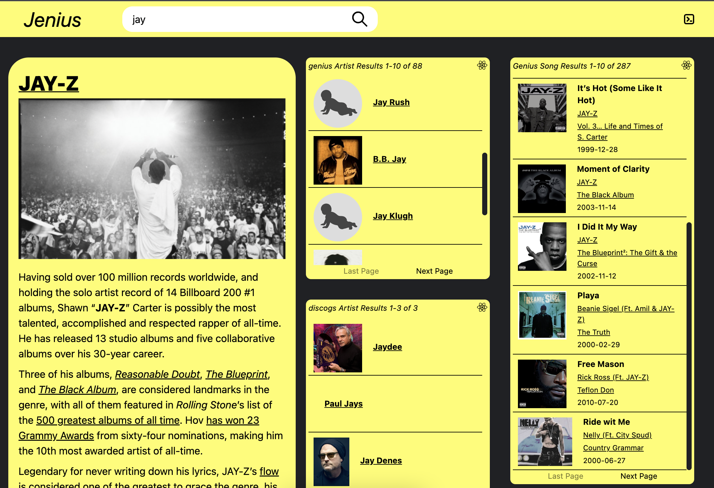

# jenius rsc

First note this repo is a development of https://github.com/bholmesdev/simple-rsc by Ben Holmes, who worked out the core server component interface using esbuild and react-server-dom-webpack. This interface will anticipate, I think, a future release of [officially supported rsc bundlers](https://react.dev/blog/2023/03/22/react-labs-what-we-have-been-working-on-march-2023#react-server-components) outside next.js.

This is an extended exploration of server components outside next.js.

I also implement a 'hydrator' pattern to decouple the processing of a server component from the view layer logic-- see /app/serverComponents/hydrators.js, /app/serverComponentShell.jsx and RscService::stream.

A benefit of this pattern vs data container HOCs or hooks encapsulation is that it allows us to transmit and manage remote state that might be relevent to the ancestor of the server component. The example use case in this demo is paginating server-rendered lists, where the page data from search is returned along with the list stream so the ancestor/host app can be aware of this remote state branch.

### Server component benefits

1. `Ultra fast, concurrent pageloads`, strong user experience- initial js bundle is slimmed down, with flexiblity to granularly select js (client components) that are required to support features. This is a benefit highlighted by the core React team. see /app/serverComponents/ArtistFeatureCard.jsx

2. We get a `no cost contract` between the client app and server that is just React props-- no need to write DSL objects (GraphQL, gRPC) or define separate types in different layers of the stack. The dx makes the server/client feel like one unified application.

3. `Data rich application without any fetching interface`-- reduce dependence on react-query, rtk-query, apollo-query, or a file filled with api error handlers. The client side rsc shell encapsulates and handles ajax transactions.

4. Strong `separation of concerns`- controller (client app, client components), view (server component), and data (hydrator) layers are isolated, very easy to reason about and test. The host/client app is now mostly responsible for reacting to user input and managing shared state.
