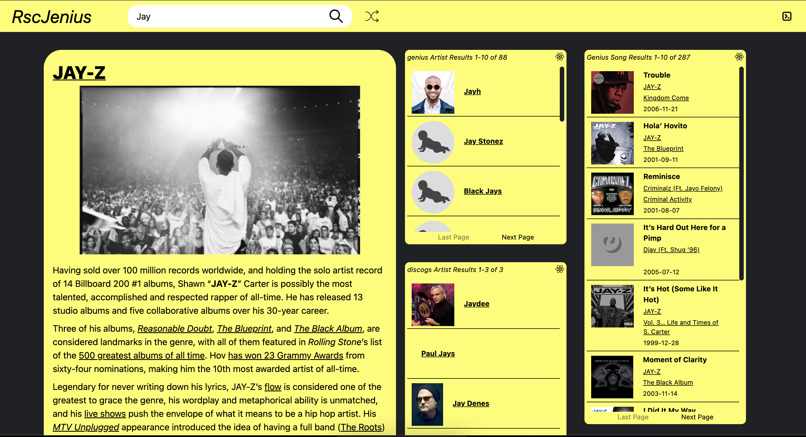

# jenius rsc

First note this repo is a development of https://github.com/bholmesdev/simple-rsc by Ben Holmes, who worked out the core server component interface using esbuild and react-server-dom-webpack, which anticipates a future release of [officially supported rsc bundlers](https://react.dev/blog/2023/03/22/react-labs-what-we-have-been-working-on-march-2023#react-server-components) outside next.js.

### hydrator pattern

I implement a 'hydrator' pattern to decouple the processing of a server component from the view layer logic, with the component parameterized to use a specific querying/database call function in the server-- see /app/hydrators.js, /app/ServerComponentShell.jsx and /server/index.js. This is likely similar to Server Action rpc functions the React team discusses in the blog entry above- the client shell uses props and a hydrator declaration to instruct the server on how to process the view layer component.

A benefit of this pattern vs data container HOCs or hooks encapsulation (putting the db call in the top of the server component) is that it allows us to transmit and manage remote state that might be relevent to the ancestors of the server component. Each hydrator has a set of metadata outputs that are returned to the caller along with the jsx.

The example use case for the hydrator pattern in this demo is paginating server-rendered lists, where the page data from a specific search is returned along with the list stream so the ancestor/host app can be aware of this remote state branch, eg the total count of the search results. Without this server -> client metadata, the client would have to make a separate ajax call alongside the server component request.

### Server component benefits

1. `Ultra fast, concurrent pageloads`, strong user experience- initial js bundle is slimmed down, with flexiblity to granularly select js (client components) that are required to support features. This is a benefit highlighted by the core React team. Example-- "sanitize-html" in /app/ArtistFeatureCard.jsx is 71kb and can stay on the server. This reduction more than makes up for the size of the streamed jsx.

2. We get a `no cost, typed contract` between the client app and server that is just React props-- no need to write DSL objects (GraphQL, gRPC) or define separate types in different layers of the stack. The dx makes the server/client feel like one unified application (similar to gRPC).

3. `Data rich application without any fetching interface`-- reduce dependence on react-query, rtk-query, apollo-query, etc. The client side rsc shell encapsulates and handles ajax transactions.

4. Strong `separation of concerns`- controller (client app, client components), view (server component), and data (hydrator) layers are isolated, very easy to reason about and test. The host/client app is now mostly responsible for reacting to user input and managing shared state.
